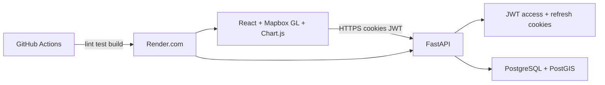

# Darukaa.Earth

Full-stack geospatial dashboard for carbon and biodiversity projects. Administrators register, create projects, draw site polygons on a map, and inspect monitoring charts over time.

- Live demo: https://darukaa-earth-frontend-dkmb.onrender.com
- API: https://darukaa-earth-qf11.onrender.com
- Repo: https://github.com/Omkar-Bhalekar/darukaa_earth

Create an account on the live site (registration is open). Locally you can also seed `demo@darukaa.earth` / `demo1234`.

## Architecture



- **Frontend:** Vite React app. Axios talks to the FastAPI origin with `withCredentials` so HttpOnly cookies are sent. Mapbox GL JS renders maps; if `VITE_MAPBOX_TOKEN` is missing, Esri World Imagery tiles still load. Chart.js powers site analytics.
- **Backend:** FastAPI routers for auth, projects, sites, and metrics. SQLAlchemy 2 async + asyncpg. Site boundaries are `geography(POLYGON, 4326)`.
- **Auth:** Register/login issue JWT access (30 min) and refresh (7 day) cookies, `SameSite=None; Secure` in production.

## Database schema

| Table | Purpose |
| --- | --- |
| `users` | id (uuid), email, hashed_password, name, created_at |
| `projects` | id, owner_id → users, name, description, project_type (`carbon` / `biodiversity`), tags[], is_deleted, created_at |
| `sites` | id, project_id → projects, name, geom (PostGIS polygon), area_hectares, ecosystem_type, monitoring_start_date, created_at |
| `site_metrics` | id, site_id → sites, recorded_date, canopy_cover_pct, ndvi, carbon_tco2e, biodiversity_index |

Migrations: `backend/alembic/versions/0001_initial_schema.py` (enables `pgcrypto` and `postgis`).

## Dataset choice

There is no public per-polygon MRV feed for user-drawn sites. On save, the API generates a **36-month synthetic restoration series**: logistic canopy growth, seasonal NDVI, ramping carbon, and stepwise biodiversity. That keeps Chart.js views useful for the hackathon without pretending the numbers are certified credits. Replace `app/metrics_synth.py` later with satellite or field APIs.

## Local setup

Requirements: Python 3.12, Node 20, PostgreSQL 15+ with PostGIS.

```bash
cp .env.example .env
# Set DATABASE_URL (postgresql+asyncpg://...) and optionally VITE_MAPBOX_TOKEN

cd backend
python -m venv .venv
# Windows: .venv\Scripts\activate
pip install -r requirements.txt
alembic upgrade head
python -m app.seed

cd ../frontend
npm ci
npm run dev
```

API: `http://localhost:8000` (Swagger at `/docs`). UI: `http://localhost:5173`.

Root hooks (once): `npm install` in the repo root so Husky is installed.

## CI/CD

**GitHub Actions** (`.github/workflows/ci.yml`) on `push`/`pull_request` to `main`:

- Frontend: `npm ci`, ESLint, Vitest, production build
- Backend: install extras, `ruff check`, `black --check`

**Render.com** (`render.yaml`):

- Backend web service: `pip install -r requirements.txt`, `alembic upgrade head`, `uvicorn app.main:app`
- Frontend static site: `npm ci && npm run build`, SPA rewrite to `index.html`
- Set `FRONTEND_URL`, `DATABASE_URL`, `JWT_SECRET`, `COOKIE_SECURE=true`, `VITE_API_URL`, `PYTHON_VERSION=3.12.10`

Pushing `main` deploys both services.

## Code quality / pre-commit

Spec requirement: Husky + lint-staged.

- Root `package.json` `prepare` installs Husky
- `.husky/pre-commit` runs `npx lint-staged`
- Staged `frontend/**/*.{ts,tsx,css,json,md}` → Prettier
- Staged `backend/**/*.py` → `python -m ruff check --fix`

CI repeats lint/tests so hooks cannot be skipped silently.

## Product flows

1. Register / login
2. Dashboard: list/create projects
3. Project: add **multiple** sites by drawing polygons
4. Map Explorer: all sites on one map; click through to analytics
5. Site detail: area, carbon, biodiversity, canopy/NDVI line chart, carbon bar chart, health doughnut, boundary map
